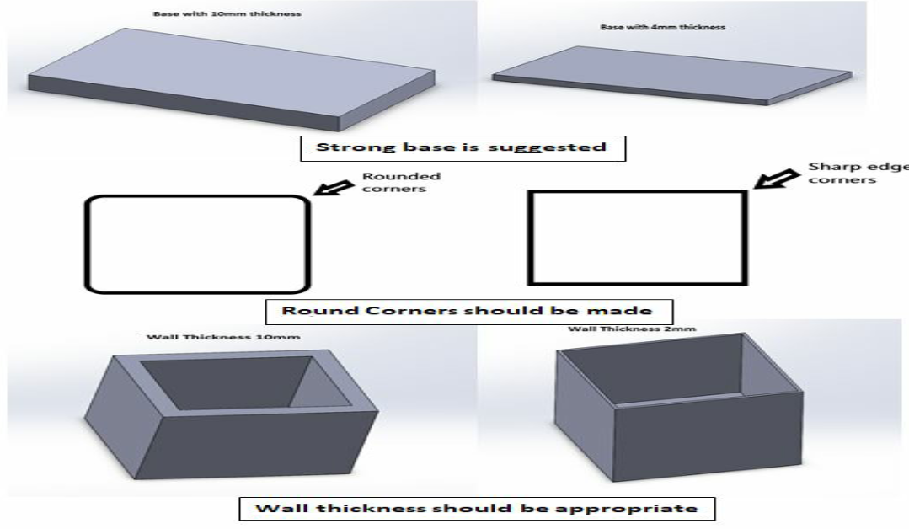
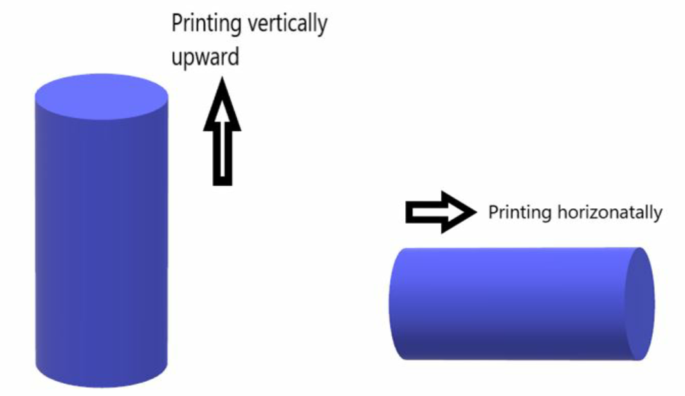
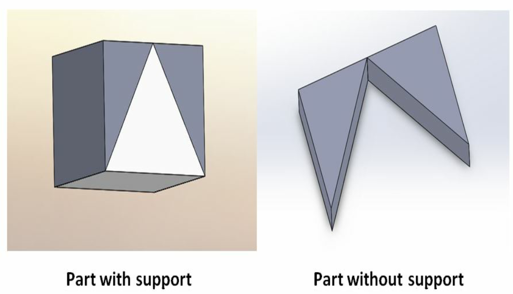
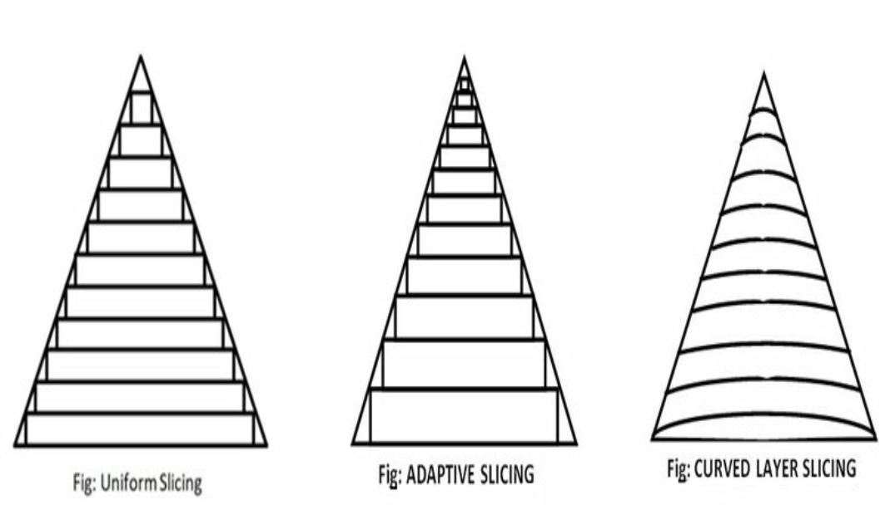
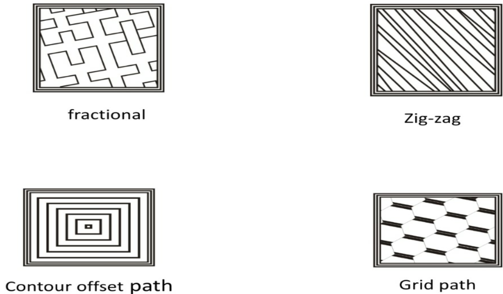

# Ex. No. 7 - SIMULATION OF PRE PROCESSING IN ADDITIVE MANUFACTURING
### DATE: 
## AIM:
### To simulate the Pre Processing for 3D printing.

## REQUIREMENTS:
### System - Windows 7 or higher, 1 GB RAM.

## PROCEDURE:
### Pre-processing encompasses the steps between design and printing. Process of 3D printing starts with designing in CAD. Then printer software slices 3D CAD file into layers. For each slice, the software converts the data into machine code that determines tool paths for the machine to follow. The various steps in pre-processing from design to printing are as follows:

### 1)	CAD File
### 2)	Conversion to STL a. Orientation b. Support Structure c. Slicing d. Path Planning

### 1. CAD File
### Every manufacturing process starts with the process of designing and as in any type of manufacturing, there are certain limitations to the materials and manufacturing processes that dictate how the product should be designed, 3D printing is no different. In 3d printing, characteristics of hardware, software, temperature, filament and many other factors play an important role in how a digital model translates into a printed object. Some of them are designed with a strong base, grain direction, overhung, wall thickness, round corners and tolerances.

### 2. Conversion to STL
### In order to check the interface of the object and make it reliable to 3d printers, conversion to STL file is required. It also facilitates other features like quick error check, bridging the gap between CAD platforms, exhibition purposes and 3D digitizer extension.

### a. Orientation:
### Orientation plays a vital role in the final product of 3d printing as it affects the part accuracy, manufacturing time, strength and surface finish. There are various orientations by which we can print the object such as vertically upward, vertically downward and in horizontal plane.

### b. Support Structure:
### Support structures are required where the objects are unable to get printed directly. Support structures help to guarantee the printability of a section during the 3D printing measure and also it can assist with forestalling part twisting, secure a section to the printing bed and guarantee that parts are joined to the fundamental body of the printed part.

### c. Slicing:
### The motive behind slicing a 3D model is to transform the model into guidelines for the 3D printer. To play out this errand, the slicing software isolates the item into numerous layers. It's classified "slicing" since it "slices" the 3D model to make numerous layers. After the layers have been made, the slicing software applies different qualities to every one of them.

### d. Path Planning:
### Path planning helps to improve the printed surface quality, shape accuracy and infill distribution quality. There are various ways for path planning which can be used to print the objects which may affect the following factors in objects like raster path, grid path, spiral path and zigzag path.

### ●	All the processes related to pre-processing will be shown on the screen.
### ●	Select CAD file preparation from the visible list.
### ●	When the first process is selected then it will open in the blank space in the left side of the screen.
### ●	Select the options of process of pre-processing in the sequence in which they are shown.
### ●	If the user follows an incorrect sequence then a pop-up will appear on the screen showing the name of the process to be selected.

## OUTPUT:

# STEP 1:

# CAD FILE PREPARATION

# EXPLANATION:

Model Design: Begin with creating or obtaining a 3D model using computer-aided design (CAD) software. Design the model according to your specifications and intended use.

Geometry Optimization: Check and optimize the geometry of your CAD model. Ensure that it is watertight, meaning it has no holes or gaps in the mesh. Repair any issues with the geometry using CAD software or dedicated mesh repair tools.

Scaling and Orientation: Adjust the size and orientation of the model as per your requirements. Consider the limitations and capabilities of your 3D printer and choose the appropriate size and orientation for successful printing.

# STEP 2:

# CONVERSION TO STL

# EXPLANATION:

Converting a 3D model to the STL (Standard Tessellation Language) file format is a common pre-processing step in 3D printing. The STL format represents the surface geometry of the object as a collection of interconnected triangles.

Use a 3D modeling software that supports the STL file format. Some popular options include Autodesk Fusion 360, Blender, SolidWorks, or Tinkercad. Make sure your software is set up and ready to export to STL.

Once your model is ready, export it to the STL file format. In your chosen 3D modeling software, look for an option to export or save the model as an STL file. You may be asked to specify the file name and location for the exported STL file.

# STEP 3:

# ORIENTATION

# EXPLANATION:

Orientation plays a crucial role in the pre-processing stage of 3D printing. Choosing the right orientation for your 3D model can significantly impact the quality, strength, and overall success of your print.

Orienting your model in a way that aligns with the printer's optimal speed axes can result in faster and more efficient printing. Optimizing the orientation can help reduce the overall print time and minimize material usage. Orienting your model to minimize unnecessary supports or reduce the number of retractions and travel moves can improve efficiency.

# STEP 4:

# SUPPORT STRUCTURE

# EXPLANATION:

Support structures are often necessary in 3D printing to provide stability and prevent overhangs and unsupported features from collapsing during the printing process. These structures act as temporary supports for overhanging or complex geometries and are typically removed after printing.

Slicing software often provides options to adjust support parameters. These parameters include support density, support pattern, support angle, and others. Depending on the specific requirements of your model, you can customize these settings to optimize the support structure generation.

Once you are satisfied with the support structures, generate the final sliced file that includes the model and the support structures. This file is then sent to the 3D printer for the printing process.

# STEP 5:

# SLICING

# EXPLANATION:

It involves taking a 3D model, dividing it into layers, and generating the instructions that the 3D printer will use to create each layer.Start by importing your 3D model into slicing software. This software takes various file formats, such as STL or OBJ, and prepares the model for printing.Determine the slicing parameters, which include settings like layer height, infill density, print speed, and shell thickness. These settings define the quality, strength, and speed of the print. Higher layer heights and infill densities result in faster but less detailed prints, while lower layer heights and higher infill densities produce more detailed and stronger prints at the cost of longer print times and increased material usage.

Save the sliced file in a format compatible with your 3D printer, such as G-code.

# STEP 6:

PATH PLANNING

# EXPLANATION:

Path planning, also known as toolpath generation, is a crucial aspect of pre-processing in 3D printing. It involves determining the optimal paths that the 3D printer's nozzle or toolhead will follow to create each layer of the printed object.

Once the perimeters and shells are defined, the algorithm generates paths for infill, which fills the interior of the model to provide support and strength. Different infill patterns, such as grid, honeycomb, or gyroid, can be used. The infill density determines the spacing and pattern complexity of the paths.

The path planning algorithm generates the final set of machine instructions, typically in G-code format. These instructions include the precise movements, print head speeds, extrusion rates, and other parameters that the 3D printer will use to create the object.

### Name:NITEESH.M
### Register Number:212222230098

## Result: 
### Thus the simulation on the Preprocessing in additive manufacturing is completed.
